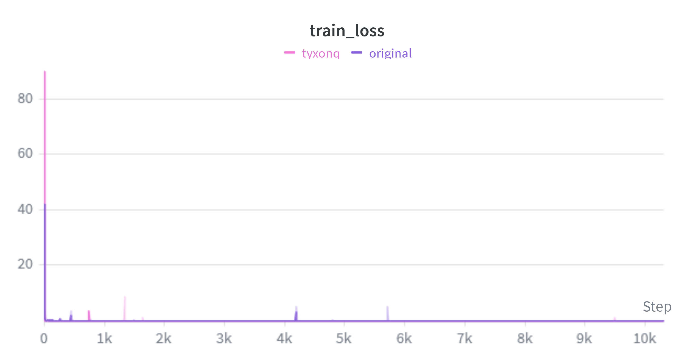
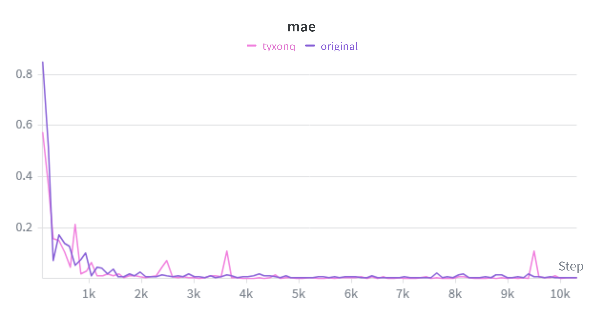
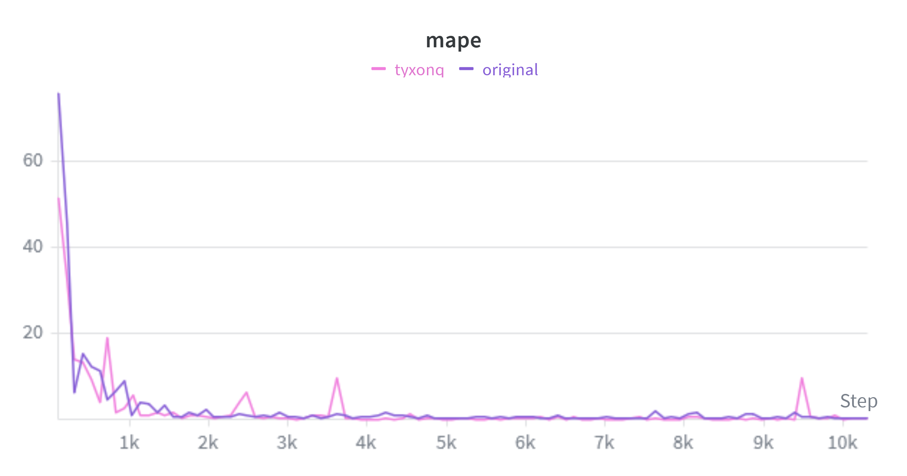
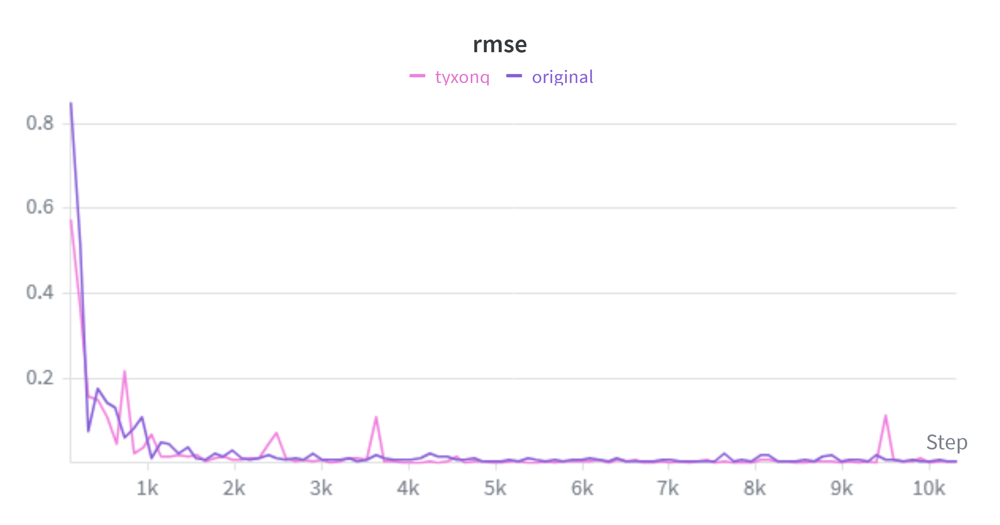

# SMILES-Inspired Transfer Learning for Quantum Operators in Generative Quantum Eigensolver

> Ref: https://arxiv.org/abs/2509.19715

Given the inherent limitations of traditional Variational Quantum Eigensolver(VQE) algorithms, the integration of deep generative models into hybrid quantum-classical frameworks, specifically the Generative Quantum Eigensolver(GQE), represents a promising innovative approach. However, taking the Unitary Coupled Cluster with Singles and Doubles(UCCSD) ansatz which is widely used in quantum chemistry as an example, different molecular systems require constructions of distinct quantum operators. Considering the similarity of different molecules, the construction of quantum operators utilizing the similarity can reduce the computational cost significantly. Inspired by the SMILES representation method in computational chemistry, we developed a text-based representation approach for UCCSD quantum operators by leveraging the inherent representational similarities between different molecular systems. This framework explores text pattern similarities in quantum operators and employs text similarity metrics to establish a transfer learning framework. Our approach with a naive baseline setting demonstrates knowledge transfer between different molecular systems for ground-state energy calculations within the GQE paradigm. This discovery offers significant benefits for hybrid quantum-classical computation of molecular ground-state energies, substantially reducing computational resource requirements.

## TyxonQ Rewrite

This repository is a rewrite of the original implementation that replaces [PennyLane](https://pennylane.ai/) with [TyxonQ](https://tyxonq.com/) as the quantum computing backend. Key changes:

- **Molecular data**: `utils/molecule_data.py` now uses `tyxonq.applications.chem` for molecular Hamiltonian construction (replacing PennyLane datasets), supporting H2, H3+, H4, H5+, H6, H8, LiH, H2O, HeH+, BeH2, NH3, BH3, N2, CO, CH4.
- **Circuit simulation**: `training/train_gptqe.py` uses `tyxonq.libs.circuits_library.ucc.build_ucc_circuit` to build and evaluate UCC circuits (replacing `qml.QNode`).

Training curves below compare TyxonQ (pink) vs original PennyLane (purple), showing equivalent convergence across all metrics.

### Training Curves

| Train Loss | MAE |
|:---:|:---:|
|  |  |

| MAPE | RMSE |
|:---:|:---:|
|  |  |

## How to use the code

### 1. Train
- Change the molecule in `molecule_data = generate_molecule_data("H2", use_ucc=True)` in `training/train_gptqe.py`.

- Supported molecules: H2, H3+, H4, H5+, H6, H8, LiH, H2O, HeH+, BeH2, NH3, BH3, N2, CO, CH4

- Run `python main.py`

- Checkpoint files will be saved at `checkpoints/*`

### 2. Predict
- `python predict_gptqe.py --model_path ./checkpoints/model.pt --molecule H2`

### 3. Transfer

- Without fine-tune: `python transfer_gptqe.py --model_path ./checkpoints/model.pt --source_molecule H2 --target_molecule H4 --n_sequences 200`

- With fine-tune: `python transfer_gptqe.py --model_path ./checkpoints/model.pt --source_molecule H2 --target_molecule H4 --n_sequences 200 --fine_tune --fine_tune_epochs 200 --save_model`
